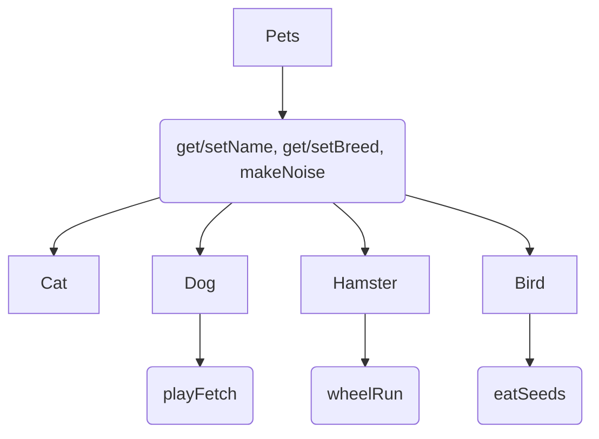

# Lab07PetStoreUpgrade
Polymorphism Application Lab

Model for Inheritance (Where the curved boxes represent are the functions and the square boxes are the classes)

Cat can definitely do overloading with badName–have a getName() and a getName(String badName) instead
Add a Bird class with a bunch of overloaded methods and more practice overriding with things like makeNoise()

- bird had generic makeNoise()
- it also has makeNoise(int) that makes a different noise depending on what int is (if statements or switch statements work here)

- eatSeeds() -- this one returns that the bird ate the seeds (string)
- eatSeeds(bool) -- this one returns whether the bird ate the seeds or not (string)
- eatSeeds(int) -- this one returns how many seeds the bird ate (string)
