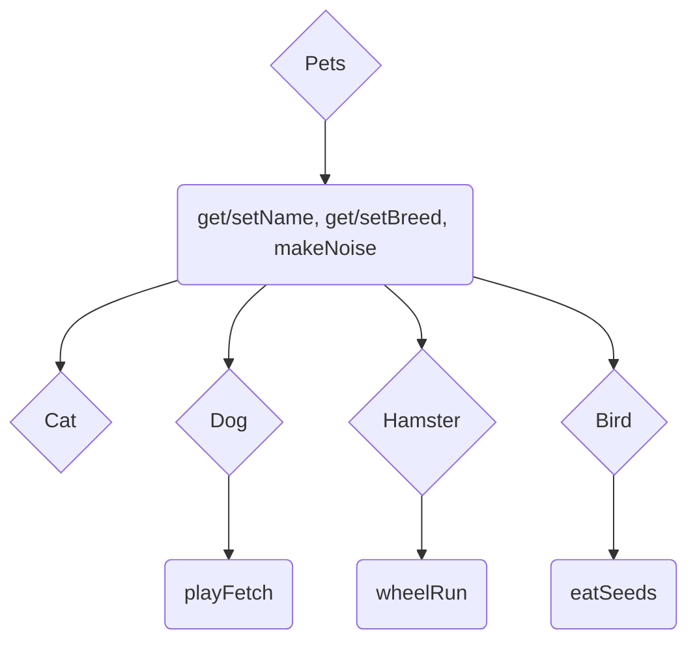

# Lab07PetStoreUpgrade
Polymorphism Application Lab

Model for Inheritance (Where the curved boxes represent are the functions and the diamonds are the classes)


# Step 0 -- Setting Up Your Files
**DO NOT SKIP THIS STEP**
Since we skipped Lab04, you will need to replace the blank java files: Hamster.java, Cat.java, Dog.java, Pets.java

With the provided solutions stored in Lab07_Starting_Classes folder 

You may find it easier to simply copy and paste the solutions in github, rather than moving around the files.

# Step 1 -- Altering Cat
In the previous lab, in order to get the Cat's badName to show up when using getName(), we had to overwrite it. But what if we only wanted to know the Cat's normal name? For this step, overload getName(String) so that this new one takes a String parameter for the badName. We will still be returning this one in the same way as the overridden version, where we return "[name] aka [badname]". For an example of overloading, see below:
```java
public double multiply(int x, int y) {
    return x * y * 1.0;
}
public double multiply(double x, double y){          //As you can see, the only thing that changes about the method's "signature" is the parameters
    return x * y;
}

```
To test your code, make a Cat object in main(), and call getName() and getName(String) on it like this:
```java
Cat Gyorik = new Cat("Gyorik", "russian blue", "Wretched Boy");
System.out.println(Gyorik.getName());   // this should return "Gyorik aka Wretched Boy"
System.out.println(Gyorik.getName("Mr. Man")); // this should return "Gyorik aka Mr. Man"
```

# Step 2 -- Bird Overriding makeNoise()
Now that our store has been upgraded, it now sells birds too. As such, our Bird class needs and override for makeNoise(). The override should return "chirp".

To test your work, make a Bird object in Bird's main and call makeNoise() on it like this:
```java
Bird Feathers = new Bird("Feathers", "parrot");
System.out.println(Feathers.makeNoise()); //this should return "chirp"
```

# Step 3 -- Bird Overloading makeNoise()
We now have a basic version of makeNoise(). However, there are a lot of different noises that birds can make. For this step, we want to make an overloaded version of makeNoise() that takes in an int as a parameter. The method should return different sounds depending on the int, following these checks:
```
1. If the int is divisible by 4, return "squawk"
2. If the int is divisible by 3, return "tweet"
3. If the int is even, return "chirp"
4. For any other number, return "caw caw"
```
To test your work, make a Bird object in Bird's main and call makeNoise(int) with a number inside of it like this:
```java
Bird Feathers = new Bird("Feathers", "parrot");
System.out.println(Feathers.makeNoise(16)); //this should return "squawk"
```
Make sure to add additional tests for each of your cases!

# Step 4 -- eatSeeds() and its Variants
In the Bird class, we have a method called eatSeeds() that returns "[name] ate some seeds". We want to make two variations on this method: eatSeeds(boolean) and eatSeeds(int). 
```
1. eatSeeds(boolean) will take in a boolean value. If the boolean is true, return  "[name] ate some seeds". If the boolean is false, return  "[name] did not eat any seeds".
2. eatSeeds(int num) will take in an int value. It will return "[name] ate [num] seeds".
```
To test your work, make a Bird object in Bird's main and call eatSeeds(bool) and eatSeeds(int) with it like this:
```java
Bird Feathers = new Bird("Feathers", "parrot");
System.out.println(Feathers.eatSeeds(false)); //this should return "Feathers did not eat any seeds"
System.out.println(Feathers.eatSeeds(17)); //this should return "Feathers ate 17 seeds"
```
